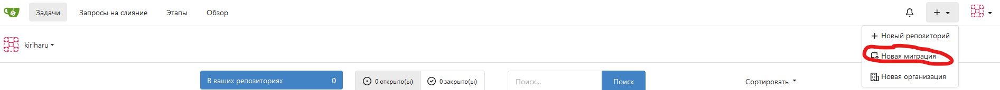
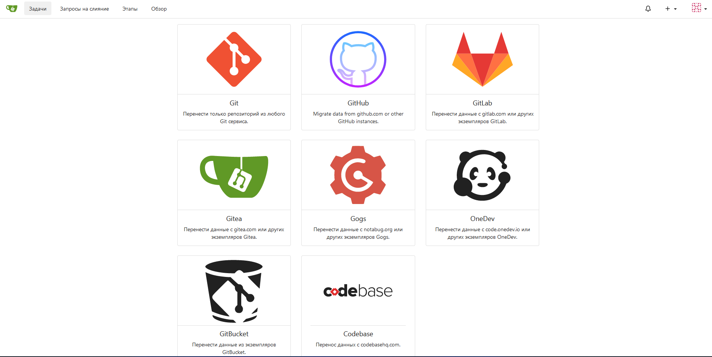
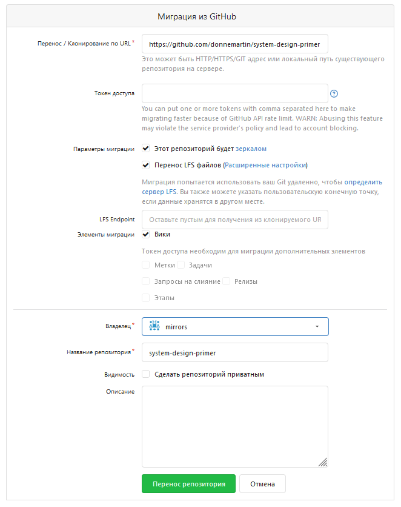
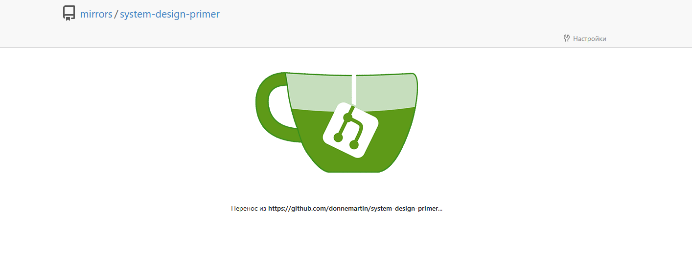
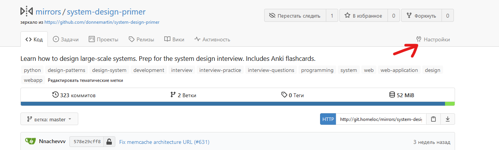

# Зеркалирование репозиториев в Gitea

Gitea - это облегченное решение для хостинга кода, написанное на Go.  
Некоторые пользователи не в курсе, но Gitea имеет возможность зеркалирования и миграции репозиториев с различных источников (например приватные репозитории GitHub).

## Начало миграции

Для начала нам необходим рабочий инстанс Gitea. Вы можете воспользоваться следующим Docker-файлом, который взят из [официальной документации](https://docs.gitea.io/en-us/install-with-docker-rootless/):

```yml
version: "2"

services:
  server:
    image: gitea/gitea:1.16.0-rootless
    restart: always
    volumes:
      - ./data:/var/lib/gitea
      - ./config:/etc/gitea
      - /etc/timezone:/etc/timezone:ro
      - /etc/localtime:/etc/localtime:ro
    ports:
      - "3000:3000"
      - "2222:2222"
```

После запуска и настройки, вы сможете начать процесс миграции.

## Миграция

1. Зайдите в свой аккаунт. Перед вами откроется рабочая область. В панели сверху нужно нажать на значок "+" и выбрать "Новая миграция":
   1. Либо можно перейти про ссылке http://ваш_сервер/repo/migrate

  

2. После чего необходимо выбрать, откуда мы будем зеркалировать репозиторий. В данном примере будем зеркалировать GitHub репозиторий. Выбираем его.

  

3. Откроется окно миграции репозитория. Здесь нужно обратить внимание на несколько вещей:
   * Необходимо в "Параметрах миграции" проставить галочку напротив пункта "Этот репозиторий будет зеркалом". После этого Gitea сама будет синхронизировать изменения с указанным репозиторием.
   * Для большего удобства я создал организацию "mirrors", в которой будут находиться зеркалируемые репозитории. Вы можете выбрать любую организацию, владельцем которой вы являетесь.

  

4. Нажимаем на кнопку "Перенос репозитория" и ожидаем. Скорость клонирования зависит от размера репозитория.



5. На данный момент это всё, но если требуется гибкая настройка, то можно зайти в настройки репозитория. Делается это так:



6. Здесь вы можете:
   1. Вручную синхронизировать репозиторий (1)
   2. Установить интервал синхронизации (2)
   3. Добавить Push-зеркало. Это позволяет пушить все изменения в Gitea, а изменения будут передавать в зеркалируемый репозиторий

Естественно, это не все возможности Gitea, для более глубокого рекомендуется взглянуть документацию.