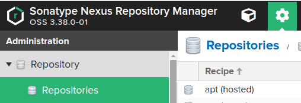
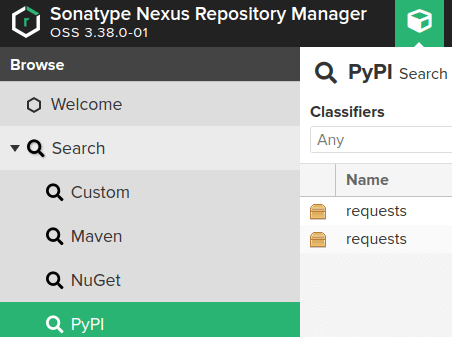

# Sonatype Nexus3 локальный репозиторий  

---
## Содержание:
* [Вступление](#вступление)
* [Разворачиваем репозиторий](#разворачиваем-репозиторий)
* [Настраиваем pip proxy](#настраиваем-pip-proxy)
* [Настраиваем docker proxy](#настраиваем-docker-proxy)
---

### Вступление
Sonatype Nexus3 - отличный опенсорсный продукт, который окажет неоценимую помощь программистам в условиях чебурнета.  
Он может как и выступать в роли локального репозитория, так и в виде прокси между тобой и целевым репозиториям.  
Плюс проксей в том, что он сохраняет только те пакеты, которые были "заказаны" через него.  

### Разворачиваем репозиторий
Для разворачивания локального репозитория нам потребуется Docker.  
Качаем из docker hub'а необходимый образ:
```bash
docker pull sonatype/nexus3:latest
```

После того, как скачали, необходимо создать файл docker-compose.yml с следующим содержимым:

```yml
version: "2.4"

services:
  nexus3:
    image: sonatype/nexus3
    volumes:
      - ./nexus-data:/nexus-data
    ports:
      - "127.0.0.1:8081:8081"
```

volumes меняем по своему вкусу, как и порты.  
Нужно помнить, что формат портов тут следующий: **HOST_PORT:IMAGE_PORT**  
Т.е. по правую сторону порты не трогаем.  
Далее необходимо создать папку nexus-data в директории, где планируем запускать репозиторий и поменять доступ к папке: 
```bash
mkdir nexus-data && chmod o+w nexus-data
```
`o+w` в данном контексте значит, что мы даём `others` права на запись в директорию.  

Запускаем репозиторий и ждём, когда он запустится. Запуск может длиться очень долго.
```bash
docker-compose up
```
Понять, что репозиторий запустился можно по следующему баннеру в терминале:  
```
-------------------------------------------------

Started Sonatype Nexus OSS 3.38.0-01

-------------------------------------------------
```

Далее необходимо поменять пароль к учетной записи администратора. Что бы получить изначальный пароль, нужно посмотреть содержимое файла `nexus-data/admin.password`  
Далее следуем указаниям wizard'а по изначальной настройке.  
**Далее все настройки будут выполняться от имени admin в nexus**  

### Настраиваем pip proxy

Идём в **настройки(шестерёнка), Repository, Repositories**:  
  
**Create repository** и выбираем **pypi (proxy)**.  
Задаём любое желаемое имя и пишем в пункт **Remote storage** следующую ссылку:  
https://pypi.org  
Пишем в **Maximum component age** -1, потому что пакеты в pip уже релизные и не нужно их перекачивать и жмём **Create repository**.   
Отлично, у нас есть локальная прокся в хранилище пакетов питона.  

Далее необходимо создать файл **pip.conf** и поместить его в **~/.pip/**.

Содержимое **pip.conf**(для примера взят адрес **localhost:8081**):
Если нужно настроить переадресацию из virtualenv, то в свежесозданую папку в корень кладём **pip.conf**
Содержимое **pip.conf**:
```ini
[global]
index = http://localhost:8081/repository/pypi-proxy/pypi
index-url = http://localhost:8081/repository/pypi-proxy/simple
```

Пробуем поставить какой нибудь пакет:
```bash
pip install requests
```
Если всё прошло хорошо, то мы увидим, что наши пакеты были сохранены в нашем репозитории:  


### Настраиваем docker proxy

Идём в **настройки(шестерёнка), Repository, Repositories**:  
  
**Create repository** и выбираем **docker (proxy)**.  

Задаём любое желаемое имя, пишем в пункте **HTTP** 7719. По этому порту мы будем подключаться в прокси.
В **Remote Storage** пишем `https://registry.hub.docker.com`  
В **Docker Index** выбираем `Use Docker Hub`  
**Maximum Component age**: `-1`  
Тыкаем кнопку **Create Repository**.

Далее необходимо указать в файле `/etc/docker/daemon.json` дополнительный пункт в конфигурации:  
```json
{
  "registry-mirrors": [
    "http://localhost:7719"
  ]
}
```
В моём случае мой **daemon.json** выглядит следующим образом:
```json
{
  "runtimes": {
    "nvidia": {
      "path": "nvidia-container-runtime",
      "runtimeArgs": []
    }
  },
  "registry-mirrors": [
    "http://localhost:7719"
  ]
}
```

Выключаем nexus нежным `Ctrl+C` в терминале, ждём, когда он выключится.  
**Проверьте, что все ваши докер контейнеры так же выключены!**  
Вводим следующую команду в терминале от имени рута:
```bash
systemctl daemon-reload && systemctl restart docker
```
Не забудьте в файле **docker-compose.yml** добавить в пункт **ports** следующую строку:
```yaml
- 127.0.0.1:7719:7719
```
Запускаем nexus и радуемся.
Стягивать образы через проксю можно следующим образом:

```bash
docker pull localhost:7719/centos
```
Если всё было сделано правильно, то у вас в списке докер образов появится новый пункт.  
Если не заработает, то создайте issue - разберёмся.  
