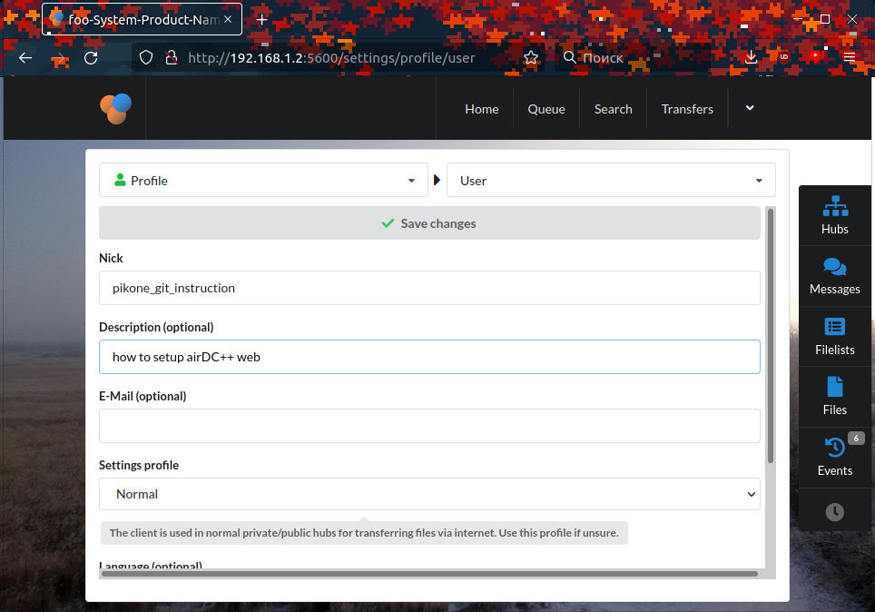
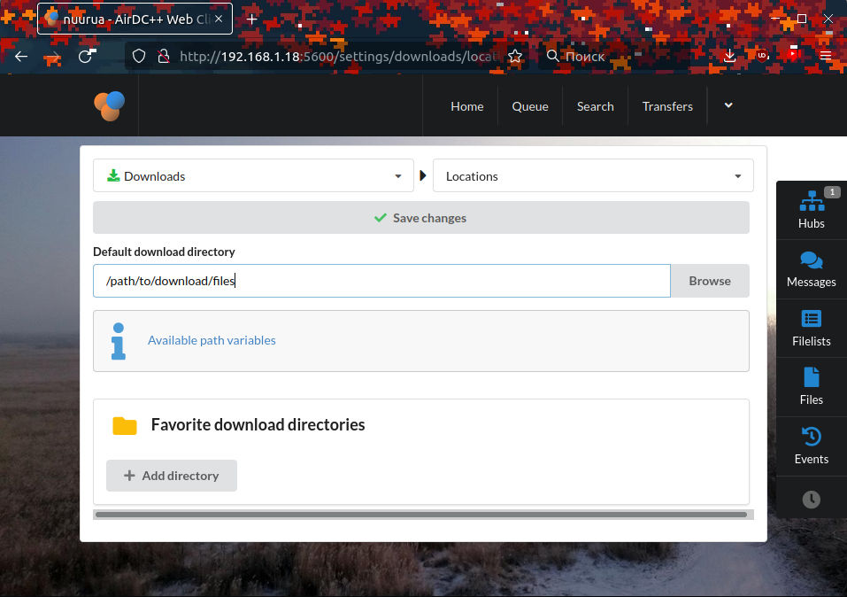
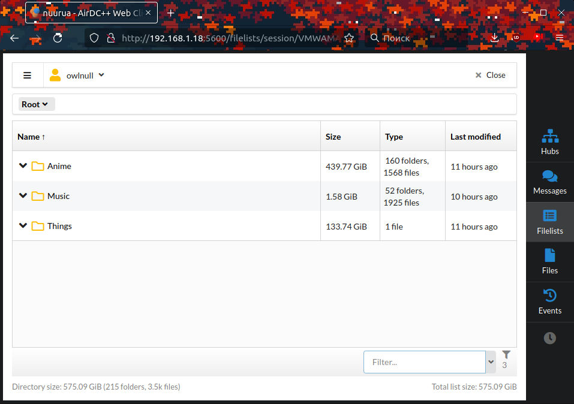
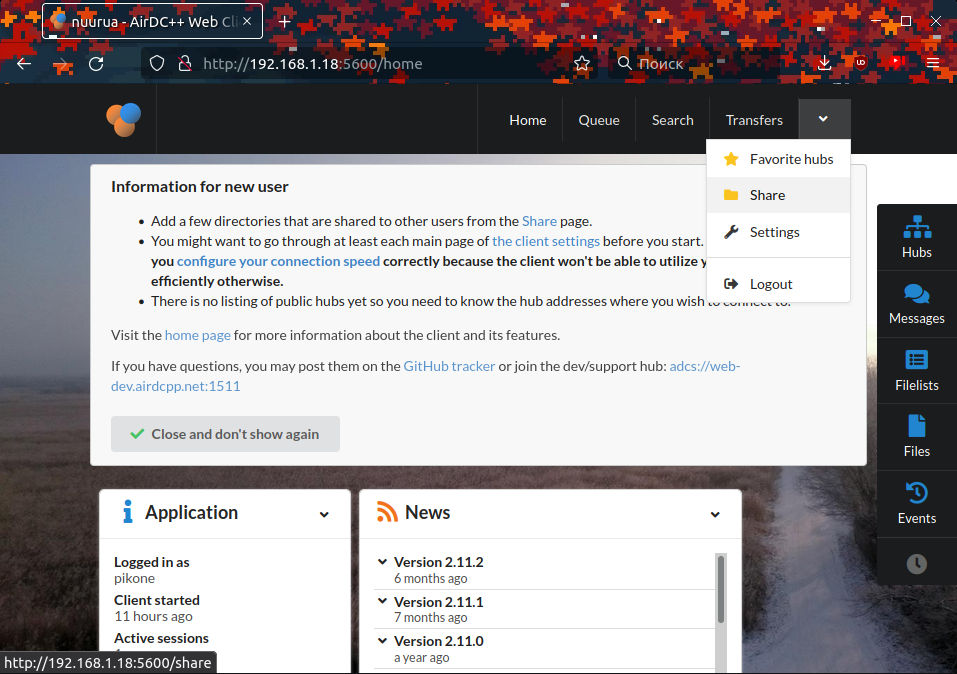
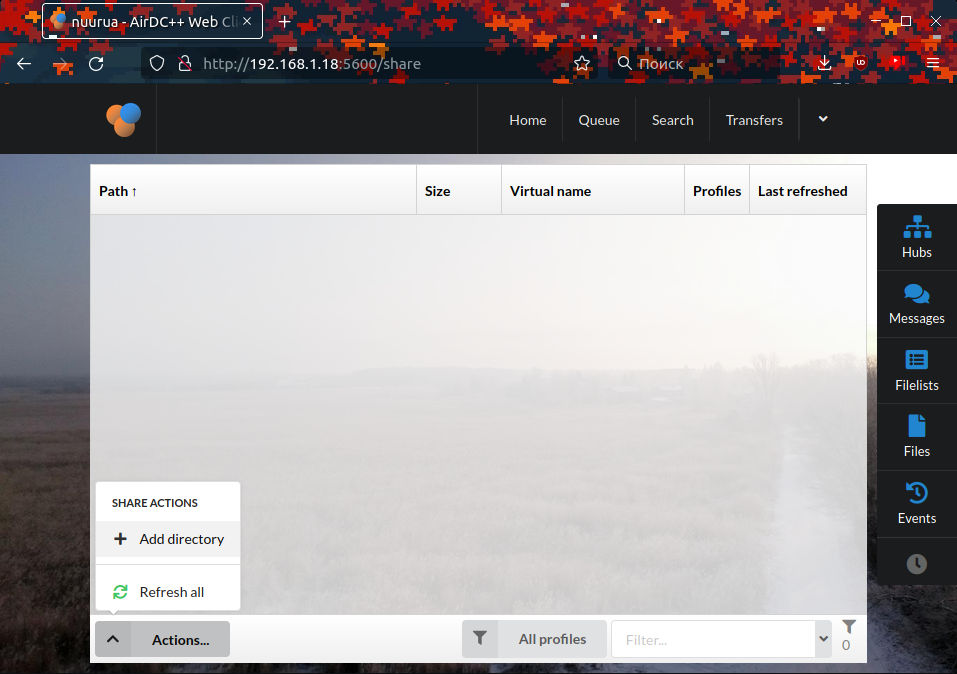

# Как шарить?

### На своем сервере
Чтобы другие люди могли просматривать сайт, необходимо его где-то хостить.
Если у вас есть сервер, можете разместить копию сайта там.

### IPFS

Однако в наше время не обязательно быть серверным лордом чтобы хостить сайт,
хватит и вашего персонального компьютера. Итак, представляю вам чудо инженерной
мысли - [IPFS](https://ipfs.io). Это децентрализованная p2p файловая система.

Есть как минимум две версии ноды IPFS:

- IPFS Destop (юзер-френдли GUI оболочка)
- IPFS cli (более для нердов командной строки)

Обе версии доступны на сайте.

Всё что нужно, чтобы хостить в сайт с помощью IPFS Desktop:

1. Скачать и запустить IPFS Desktop
2. На вкладке _Files_ нажать кнопку `Import` и выбрать вариант `Folder`
3. Далее в окне навигации выберите папку `xyz.com` с сохраненным ранее сайтом
4. После импорта вы можете скопировать ссылку, нажав на троеточие рядом
рядом с именем файла и выбрав `Share link`. Эту ссылку можно отправить своим товарищам,
чтобы они могли посмотреть, что вы там насохраняли.

Для того чтобы файл оставался на вашей ноде постоянно, не забудьте поставить _Pinning_
в вышеупомянутом меню опцией `Set pinning`

Действия для CLI версии:

1. Смените текущую директорию на место куда вы сохранили сайт, к примеру:
```sh
cd ~/archive/xyz.com
```
2. Запустите команду
```sh
ipfs add -r .
``` 
Это выведет в терминал кучу CIDов, последний из них указывает на директорию целиком.
Вы можете поделиться ссылкой вида `https://ipfs.io/ipfs/<CID>`, которая будет вести на эту директорию.

### BitTorrent

Еще одна децентрализованная сеть для обмена файлами.
Менее оптимальна чем IPFS для данной задачи, но тоже пойдет.

Пример создания торрента на примере клиента [qBitorrent](https://www.qbittorrent.org):

1. В меню `Сервис` выберите опцию `Создать торрент`, или нажмите сочетание клавиш `Ctrl + N`
2. Введите путь к файлу или папке, которые хотите раздавать
3. Включите галку `Начать раздачу сразу`
4. Введите адреса трекеров, чем больше тем лучше

Список трекеров можно взять отсюда: https://github.com/ngosang/trackerslist

## DC++

DC++ - Файлообменная, частично централизованная, P2P сеть. Частично, потому что для своей работы требует hub с белым IP адресом.

Клиенты:
- [AirDC++](https://www.airdcpp.net/)
- [EiskaltDC++](https://github.com/eiskaltdcpp/eiskaltdcpp)
- [microdc2](https://github.com/jnwatts/microdc2)
- [ncdс](https://dev.yorhel.nl/ncdc)

### AirDC++ Web (Linux)

Web клиент для работы с Direct Connect

Программу можно скачать с оффициального [сайта](https://airdcpp-web.github.io/docs/installation/installation.html)

На Linux AirDC++ управляется с помощью Web интерфейса, что позволяет запускать его на серверах без графики. 

После загрузки архива его можно разархивировать с помощью tar:

```sh
tar -xfv airdcpp_2.11.2_webui-2.11.2_64-bit_portable.tar.gz ~/
```

Далее переходим в каталог `airdcpp` и запускаем конфигурацию `aitdcppd`

```sh
~/airdcppd --configure
```
Далее следуем инструкциям. Порт можно оставить по умолчанию. Пользователь и пароль вводятся для доступа к Web интерфейсу

По завершению конфигурации можно запустить сервер

```sh
./airdcppd
```
После запуска можно переходить в браузер, указав в адресную строку `http://<IP>:<PORT>` для дальнейшей настройки клиента. 


Вводим данные, которые указывали при конфигурации

Для правильной раздачи и подключения к hub'ам необходимо немного настроить клиент

1. Переходим в настройки клиента


2. В полях устанавливаем имя, по желанию прописываем Description
   


> Важно не забыть сохранить настройки вверху страницы

3. Настроить скорость соединения. По умолчанию она равна 0.1 Mbit/s, поэтому нужно выставить значения, которые сможет "понятнуть" ваша сеть.


4. Нужно обязательно помнить, что файлы будут загружаться туда, где установлен airDC++, а не в браузер. Поэтому нужно настроить каталог загрузки файлов.



Теперь можно приступить к использованию aitDC++. Для этого нам нужно добавить hub. Для управления hab'ами, справой стороны, есть кнопка Hubs. 


После ввода IP адреса у нас появится чат hub'а. 


Для просмотра списка участников достаточно справа внизу включить переключатель `User List`. После этого появится список всех пользователей. Уже конкретно у них можно смотреть файлы, которые они раздают




Для раздачи своих файлов нужно:

1. Перейти во вкладку `Share`



2. Справа внизу `Actions` -> `Add directory`



3. Указать путь до файлов и задать виртуальное название, которое будут видеть участники 


После добавления файла он будет доступен всем участникам в hub'е