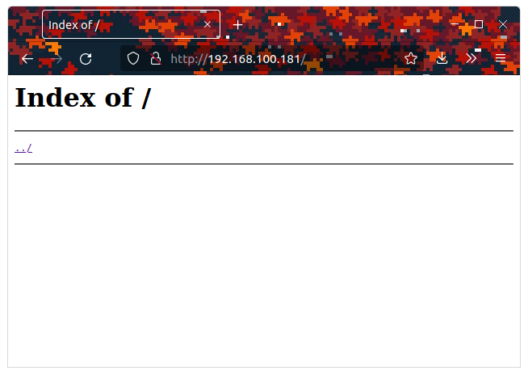
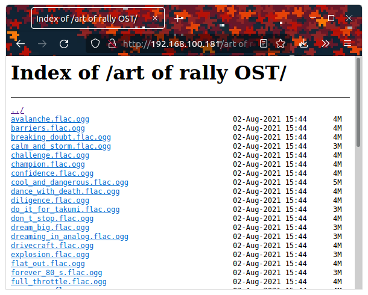

# Nginx

[Официальный сайт](https://nginx.org/)

Nginx (Engine-X) - высокопроизводительный web сервер. Для сохранения интернета он интересен своим модулем - [autoindex](https://nginx.org/ru/docs/http/ngx_http_autoindex_module.html), который позволяет выводить содержимое каталога и скачивать файлы оттуда. Собственно это как раз по теме раздачи файлов.

## Установка и настройка (Linux)

Рассмотрим установку и настройку на примере дистрибутива `Debian`

Пакет доступен в стандартном репозитории Debian, поэтому достаточно выполнить:

```sh
apt update; apt upgrade; apt install nginx -y; systemctl status nginx
```

Убедившись, что сервер запустился, можно приступать к его конфигурированию. 

## Конфигурация

Конфигурационные файлы находятся в каталоге `/etc/nginx`. Но перед созданием нового файла нужно очистить от начальной конфигурации

```sh
cd /etc/nginx/sites-enabled && rm -f *
```
Далее вооружаемся любимым текстовым редактором и идем создавать новую конфигурацию. Для этого достаточно создать файл с любым именем по пути `/etc/nginx/sites-avaliable`. Для примера назовем его `share`. После создания прописываем туда следующие строки:

```nginx
server {
        listen 80;
        listen [::]:80;
        root /var/www/share;
        location / {
                try_files $uri $uri/ =404;
        }

        autoindex on;
        autoindex_exact_size off;

        server_tokens off;
}
```

Далее выходим из редактора и делаем символьную ссылку указывая nginx, что этот сайт должен быть активен

```sh
ln -s /etc/nginx/sites-avaliable/share /etc/nginx/sites-enabled/
```

Вот теперь можно перезапускать nginx и заходить через браузер на сервер

```sh
systemctl restart nginx
```

Должно получится что-то такое



Теперь в каталог `/var/www/share` можно загружать файлы и они будут отображаться на первой странице



__Обязательно__ нужно выставить права на каталоги (`0755`) и файлы (`0644`):

```sh
chmod 0755 /var/www/share && chmod 0644 /var/www/share/*
```
