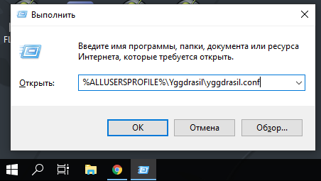
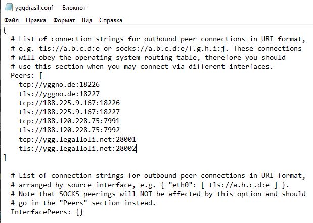
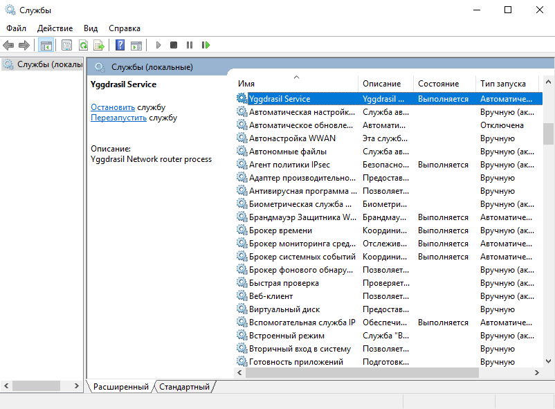
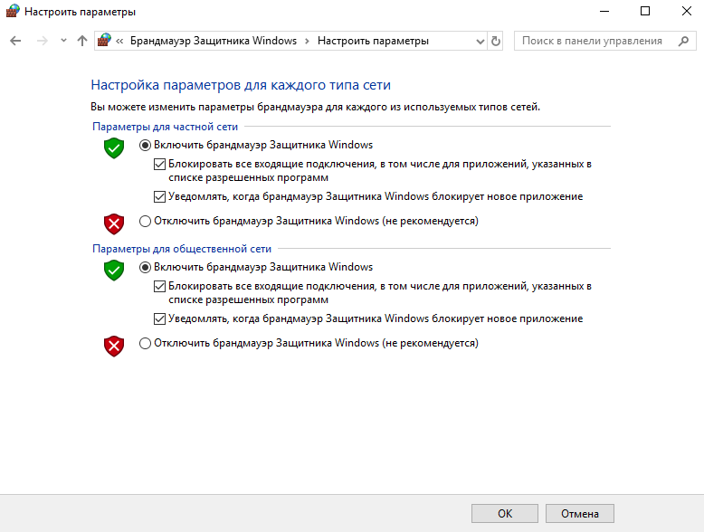
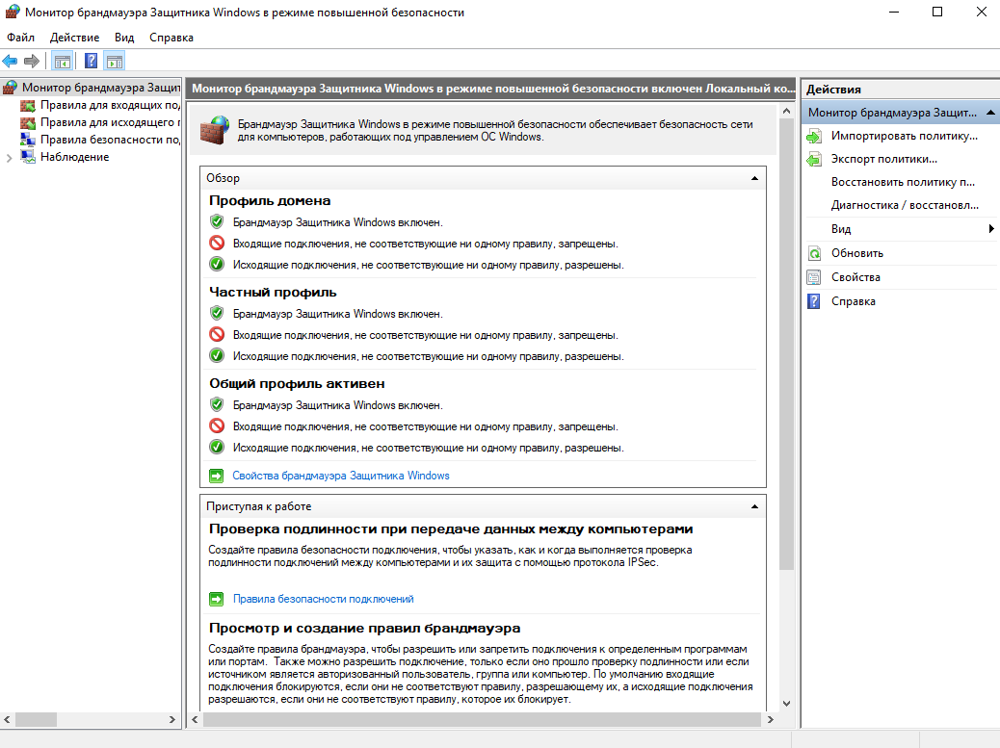

# Yggdrasil

Yggdrasil - это сетевой протокол и организованная с помощью него компьютерная сеть со сквозным шифрованием и автоматической маршрутизацией. По факту интернет поверх интернета. За счет этого у каждого есть статический IPv6 адресс. Это можно сравнить с VPN, но yggdrasil, в отличии от VPN, работает на 3-м уровне модели OSI, что позволяет использовать его даже внутри локальных сетей, которые не имеют выхода в интернет

В нем можно поднимать сервисы точно также, как и в clearnet, только указывая везде IPv6 адрес. Он использует диапазон адресов, который не рекомендован к использованию IETF с 2004 года: `0200::/7`

Для работы yggdrasil в сети internet нужны peer'ы - это компьютеры с "белым" IP адресом, которые помогают участникам сети находить маршруты друг с другом. Peer'ы никак не учавствую в передаче информации.

## Предупреждение!

__Yggdrasil НЕ ОБЕСПЕЧИВАЕТ АНОНИМНОСТЬ И БЕЗОПАСНОСТЬ, для этого есть другие инструменты (i2pd, tor).__

[Сайт проекта](https://yggdrasil-network.github.io/)

## Установка (Linux)

### Pre-Build binares

Собранные бинарные пакеты можно скачать по [ссылке](https://yggdrasil-network.github.io/builds.html). Там собраны пакеты для большинства дистрибутивов. Рассмотрим установку на примере `Debian`.

1. Скачиваем пакет с github yggdrasil:

```sh
# wget https://github.com/yggdrasil-network/yggdrasil-go/releases/download/v0.4.3/yggdrasil-0.4.3-amd64.deb
```

> Актуальную ссылку можно взять в разделе "Releases": [тык](https://github.com/yggdrasil-network/yggdrasil-go/releases)

2. Установить скачаный пакет

```sh
# dpkg -i yggdrasil-0.4.3-amd64.deb
```

Далее сразу перейти к разделу "Настройка peer'ов"

## Установка (Windows)

### Pre-Build binares

1. Скачать бинарный файл `msi` из раздела "Releases": [ссылка](https://github.com/yggdrasil-network/yggdrasil-go/releases)
2. Установить скачаный файл

## Настройка peer'ов

Как уже объяснялось выше, peer'ы нужны для налаживания связей между другими участниками сети. Чтобы yggdrasil знал какие peer'ы использовать их нужно указать в конфигурационном файле.

Взять адреса peer'ов можно из специального [репозитория](https://github.com/yggdrasil-network/public-peers/blob/master/europe/russia.md). Так как задача состоит в том, чтобы сеть работала даже с "железным зановесом", следует брать peer'ы, которые находятся в РФ

### Linux

Для добавления peer'ов достаточно открыть файл `/etc/yggdrasil.conf` и в раздел `peers[]` вписать адреса скопированные ранее из списка

Должно получится что-то вроде такого:

```sh
  Peers:
  [
    tcp://yggno.de:18226
    tls://yggno.de:18227
    tcp://188.225.9.167:18226
    tls://188.225.9.167:18227
    tcp://188.120.228.75:7991
    tls://188.120.228.75:7992
    tcp://ygg.legalloli.net:28001
    tls://ygg.legalloli.net:28002
  ]
```

Сохраняем файл 

### Windows

Нажать `WIN + R` и выполнить команду: 

```powershell
%ALLUSERSPROFILE%\Yggdrasil\yggdrasil.conf
```


Открыть файл через "Блокнот" и в раздел `peers[]` вписать адреса скопированные ранее из списка

Должно получится что-то вроде такого:



Сохраняем файл

## Запуск сервиса

Теперь yggdrasil необходимо запустить

### Linux

Для систем с systemd достаточно выполнить команду:

```sh
# systemctl enable --now yggdrasil
```

После чего можно проверить адрес нового интерфейса:

```sh
ip a
3: tun0: <POINTOPOINT,MULTICAST,NOARP,UP,LOWER_UP> mtu 53049 qdisc pfifo_fast state UNKNOWN group default qlen 500
    link/none 
    inet6 201:a41d:61e2:51a6:ffcc:8d68:5e15:8033/7 scope global 
       valid_lft forever preferred_lft forever
    inet6 fe80::a93d:589f:b4d5:4ed4/64 scope link stable-privacy 
       valid_lft forever preferred_lft forever
```

Первый inet6 и будет являтся вашим ip адресом в сети Yggdrasil

### Windows

Нажать `WIN + R` и выполняем команду: 

```powershell
services.msc
```

Далее в открывшемся окне найти службу Yggdrasil и слева нажать "Перезапустить службу"



Осталось только проверить адрес. Нажать `WIN + R` и выполнить команду: 

```powershell
cmd
```

И в консоли написать

```powershell
ipconfig
```

Должно получится вот такое:

```powershell
C:\Users\admin>ipconfig

Настройка протокола IP для Windows


Неизвестный адаптер Yggdrasil:

   DNS-суффикс подключения . . . . . :
   IPv6-адрес. . . . . . . . . . . . : 202:94f9:f7d9:e7e:a322:d9db:e54c:f692
   Автонастройка IPv4-адреса . . . . : 169.254.160.204
   Маска подсети . . . . . . . . . . : 255.255.0.0
   Основной шлюз. . . . . . . . . :
```

# Обязательная настройка

После установки Yggdrasil все ваши порты открыты в сеть. __ЭТО НЕ БЕЗОПАСНО__. Чтобы такого не было НУЖНО настроить брандмауэр

### Linux

В качестве брандмауэра для linux можно использовать ufw


```sh
# Для начала запрещаем все входящие подключения, и разрешаем все исходящие:
ufw default deny incoming
ufw default allow outgoing

# Если настройка производится на удаленной машине к которой вы подключены по ssh сессии,
# Необходимо разрешить порт для ssh
# если вы используете дефолтные настройки разрешаем 22 порт:
ufw allow ssh 

# иначе разрешаем порт, который вы используете, например:
ufw allow 5555

# Далее, для начала его работы, достаточно ввести:
ufw enable

# Проверить текущее состояние и установленные правила:
ufw status
```

После его включения добавляйте нужные вам порты в ручную.

### Windows

В панели управления найти настройку `Брандмауэр Защитника Windows` и изменить параметры уведомлений на включенные



После применения этих настроек, добавляйте нужные вам порты в ручную через "Монитор брандмауэра Защитника Windows"



# Как обезопасить себя

Всё же сеть Yggdrasil более опасна, чем обычный интернет. Используя сеть Yggdrasil вы не скрыты за NAT'ом, вы видны всей сети. Вас не может защитить ни провайдер, ни роутер со встроенным брандмауэром. Ни одна защита не работает в Yggdrasil __КРОМЕ ВАС__.

Поэтому вы __ДОЛЖНЫ__ защитить себя __САМИ__ не надеясь ни на кого. Не относитесь к этому легкомысленно

- Не оставляйте на своей рабочей машине запущенными сервисы, которыми не пользуетесь, например веб-сервер (nginx, apache). 
- Не открывайте порты без необходимости. Открывайте их только если вы уверены, что именно этот порт нужен вам
- ОБНОВЛЯЙТЕСЬ. Да, всеми не любимая задача, но только это сможет защитить вас от бэкдоров и уязвимостей
- Ходите по yggdrasil через браузер в контейнере. Это поможет вам защититься от отслеживания
- Проверяйте все скачанные файлы с помощью [ClamAV](https://github.com/Cisco-Talos/clamav)
- Используйте открытое ПО. Ещё лучше - если вы будете собирать его сами.
- Подтверждайте свои загрузки с помощью хэш сумм. Пример: скачали Debian с официального сайта? Не поленитесь, проверьте hash сумму. Это поможет защитить вас от компромитирования данных

## Полезные ссылки:

https://howto.yggno.de/ - Wiki Yggdrasil